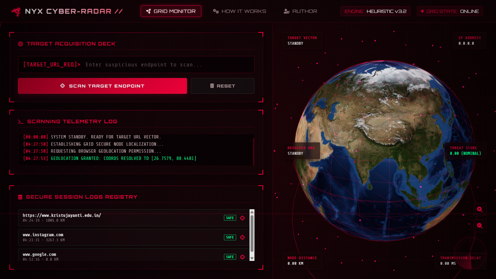
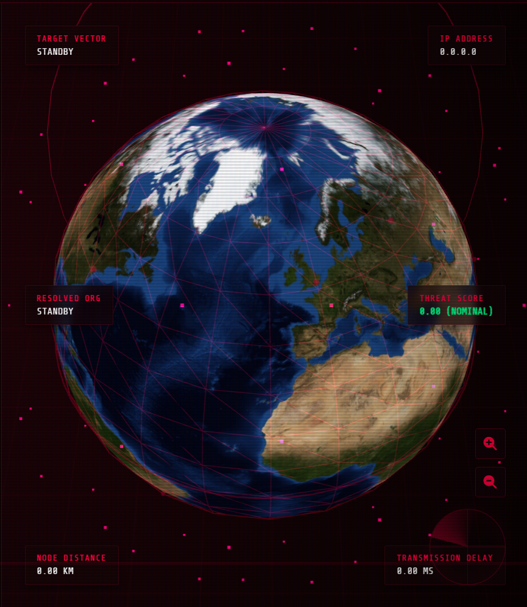
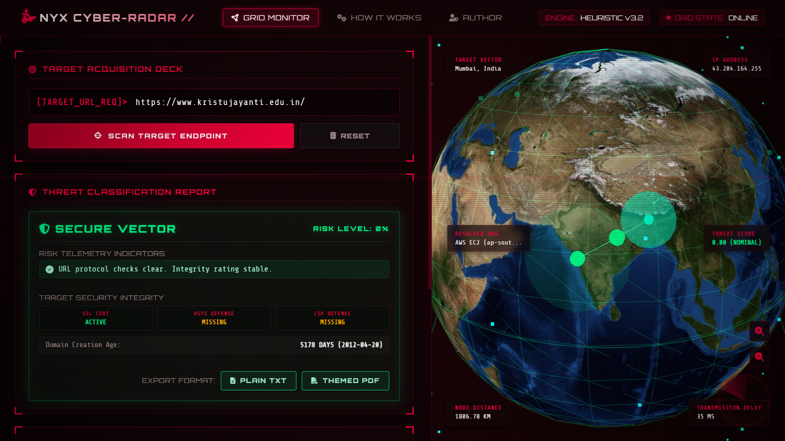
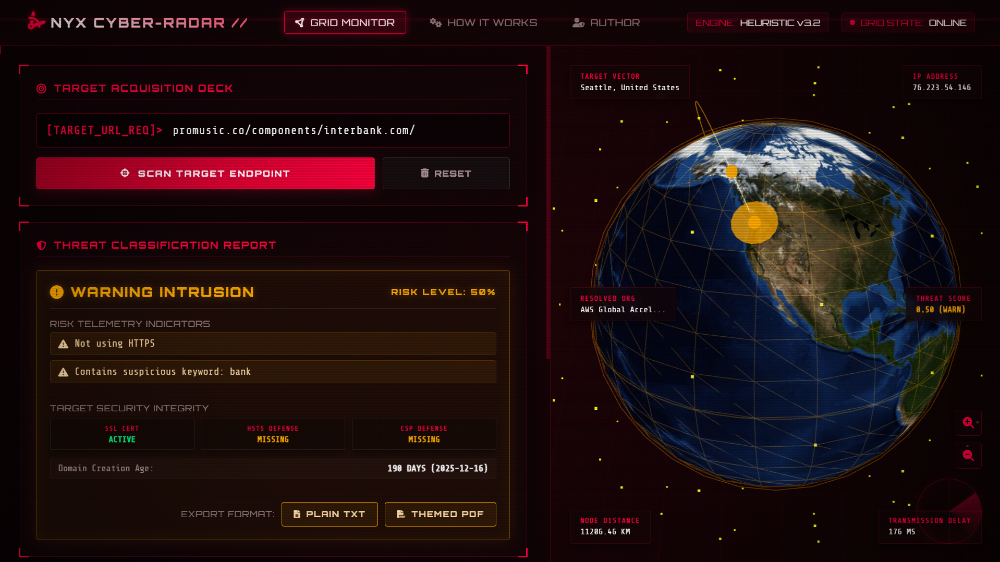
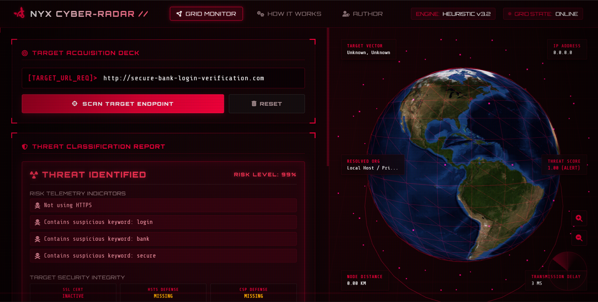
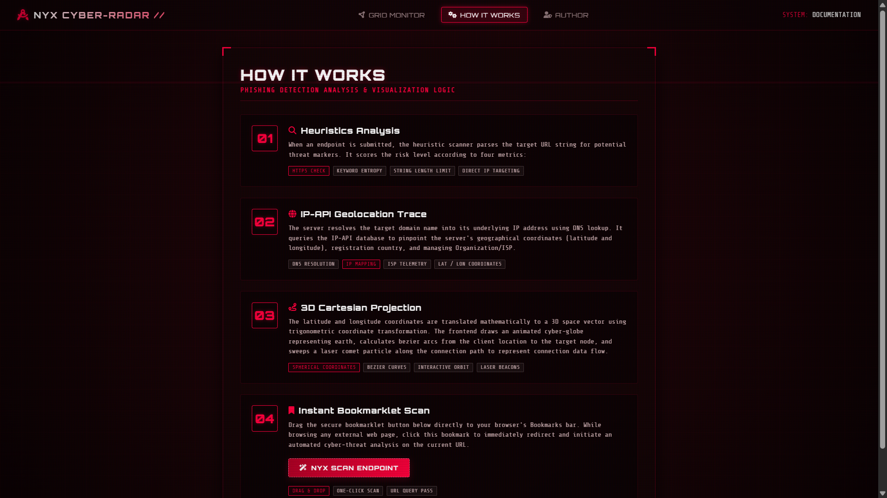
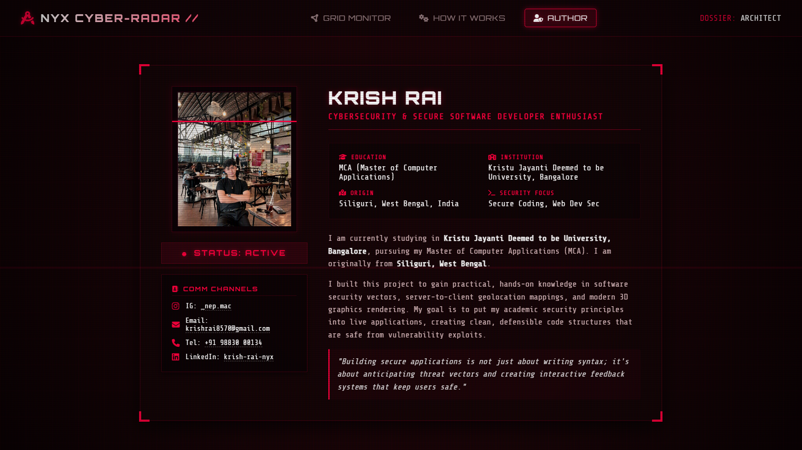
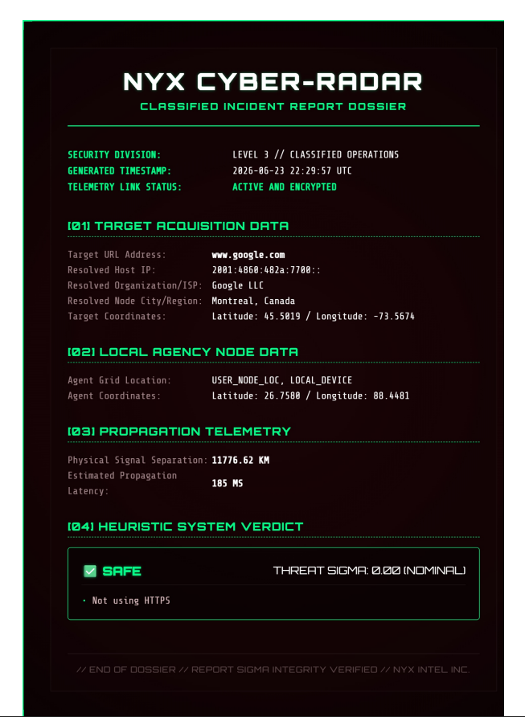

# ⚡ NYX Cyber-Radar

### Advanced Phishing Detection & Cybersecurity Intelligence Dashboard

---

## 📌 Overview

**NYX Cyber-Radar** is an advanced, hacker-themed cybersecurity web application designed to detect phishing URLs and analyze their security posture in real-time.

It goes beyond basic phishing detection by integrating **network intelligence, SSL inspection, WHOIS analysis, and geolocation tracking**, all visualized through an immersive cyber interface.

---

## 🎯 Objective

To design and develop a **web-based phishing detection and analysis system** that identifies malicious URLs using heuristic analysis and security auditing techniques.

---

## 🚀 Features

### 🔍 Phishing Detection Engine

* Detects suspicious URLs using:

  * HTTPS validation
  * URL length analysis
  * Suspicious keyword detection
  * IP-based URL detection
  * Domain age (WHOIS)

---

### 🌍 Geolocation Tracking

* Detects:

  * Target server location
  * IP address
  * ISP information
* Maps connection between user and target

---

### 🔐 SSL Certificate Analysis

* Checks:

  * Certificate validity
  * Issuer details
  * Expiry information

---

### 🛡️ Security Headers Audit

* Verifies presence of:

  * `Strict-Transport-Security` (HSTS)
  * `Content-Security-Policy` (CSP)
  * `X-Frame-Options`

---

### 📊 WHOIS Domain Intelligence

* Extracts:

  * Domain creation date
  * Domain age
* Flags newly registered domains (high risk)

---

### 🎨 Immersive Cyber UI

* Hacker-style interface (NYX theme)
* Animated scanning effects
* Matrix-style visuals
* Neon cyber aesthetics

---

### 📡 API Endpoint

* `/api/scan`
* Returns structured JSON data including:

  * Threat result
  * Reasons
  * Geo data
  * SSL details
  * Headers analysis

---

## Demo Preview


## 📸 Screenshots

### 🧠 NYX Dashboard Interface



---

### Globe 3D Model



---

### 🔍 Live Scan Result

### ✅ Safe URL Detection


### ⚠️ Suspicious URL Detection


### ❌ Phishing Threat Detection


---

### How it Works


---

### Author


---

### Report PDF


---

## 🛠️ Tech Stack

* **Backend:** Python (Flask)
* **Networking:** Socket, SSL, urllib
* **Security Analysis:** WHOIS, Headers Audit
* **Frontend:** HTML, CSS, JavaScript
* **Visualization:** Three.js (3D Globe)

---

## ⚙️ Installation & Setup

### 1. Clone the repository

```bash
git clone https://github.com/KrishRai17/NYX-Cyber-Radar.git
cd NYX-Cyber-Radar
```

### 2. Install dependencies

```bash
pip install flask
```

### 3. Run the application

```bash
python app.py
```

### 4. Open in browser

```text
http://127.0.0.1:5000
```

---

## 🧪 Usage

1. Enter a URL in the input field
2. Click **Scan Target**
3. View:

   * Threat level
   * Security issues
   * Network intelligence data

---

## 📊 Sample Output

```json
{
  "result": "❌ Dangerous (Phishing Likely)",
  "reasons": ["Not using HTTPS", "Contains suspicious keyword"],
  "ssl_telemetry": { "active": true },
  "headers_telemetry": { "hsts": false },
  "whois_telemetry": { "domain_age_days": 5 }
}
```

---

## 🔐 Security Concepts Covered

* Phishing Detection Techniques
* SSL/TLS Inspection
* WHOIS Intelligence Gathering
* Security Headers Analysis
* Network & IP Analysis
* Secure Coding Practices

---

## 🏆 Project Highlights

✔ Real-world cybersecurity concepts
✔ Advanced threat detection logic
✔ Interactive cyber UI
✔ API-based architecture
✔ Industry-inspired design (Cowrie, SIEM dashboards)

---

## 🔗 Links

* **GitHub Repository:**
  https://github.com/KrishRai17/NYX-Cyber-Radar

* **LinkedIn Post:**
  

---

## 👨‍💻 Author

**Krish Rai**
Kristu Jayanti Deemed to be University, Bangalore

* 📧 Email: [krishrai8570@gmail.com](mailto:krishrai8570@gmail.com)
* 🔗 LinkedIn: https://www.linkedin.com/in/krish-rai-nyx

---

## 📄 License

This project is for educational and cybersecurity learning purposes only.
